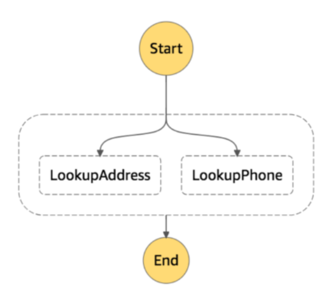

# Introduction

## References

- [Step function Docs](https://docs.aws.amazon.com/step-functions/latest/dg/welcome.html)
- [Step function Api reference](https://docs.aws.amazon.com/step-functions/latest/apireference/Welcome.html)
- [Youtube AWS web services](https://www.youtube.com/c/amazonwebservices/search?query=step%20function)

- [AWS SDK for javascript](https://docs.aws.amazon.com/sdk-for-javascript/v3/developer-guide/welcome.html)

## Features

- Manage execution order
- Visualization
- Error handling
- Automatic retries
- Triggering & Tracking

## Benefits

- Create complex workflows
  - Handle large number of connected steps
  - Handle errors on the work flow level
  - Easy error detection
- Long lived
  - Wait a long time between steps
  - React to outside factors
- Logic separation
  - No workflow logic on business logic
  - Workflow designers don't have to know about services they use
- Parallelism
  - Multiple running instances
  - Run sub steps in parallel

## Standard Vs Express

| Standard                                 | Express                                                                       |
| ---------------------------------------- | ----------------------------------------------------------------------------- |
| Run for one year                         | Run for 5 minutes                                                             |
| 2,000 executions per second              | 100,000 executions per second                                                 |
| 4,000 transitions per second per account | Nearly unlimited state transitions                                            |
| Priced per state transition              | Priced on the number of executions, the duration and their memory consumption |
| Support Activities                       | Don’t support Activities                                                      |

- [Pricing](https://aws.amazon.com/step-functions/pricing/)

## States

### Task

- Lambda Function
- Activity
  - Logic running on premise or EC2
- Supported AWS Service
  - AWS Batch Job
  - Amazon SNS
  - Amazon SQS
  - AWS Glue

### Choice

- **Add custom examples for each state**

- And, Or, Not conditions can be used
- Expression variables can be Boolean, String, Numeric or Timestamp

```js
{
    "NotificationChoice": {
        "Type": "Choice",
        "Choices": [{
                "Variable": "$.isSMSOnly", //If the value of the isSMSOnly property is True continue to the SendSMS step
                "BooleanEquals": True,
                "Next": "SendSMS"
            },
            {
                "Variable": "$.isSMSOnly", //If the value of the isSMSOnly property is False continue to the sendEmailAndSMS step
                "BooleanEquals": False,
                "Next": "sendEmailAndSMS"
            },
        ],
        "Default": "sendEmailAndSMS" //Default to sendEmailAndSMS if none of the choices match
    }
}
```

### Wait

- Halt execution of workflow
  - Wait an amount of time like 30 Seconds
  - Wait till a specific time like 31 December 2021

```js
{
    "WaitUntil": {
        "Type": "Wait",
        "Seconds ": 30,
        "Next": "NextState"
    }
}
```

```js
{
    "WaitUntil": {
        "Type": "Wait",
        "Timestamp": "31 December 2020T00:00:00Z",
        "Next": "NextState"
    }
}
```

```js
{
    "WaitUntil": {
        "Type": "Wait",
        "TimestampPath": "$.expiryDate",
        "Next": "NextState"
    }
}
```

### Pass

- Add input to the output
  - Debugging and constructing state machines

```js
{
    "Pass1": {
        "Type": "Pass",
        "Result": {
            "firstName ": "Albert",
            "lastName ": "Einstein"
        },
        "ResultPath": "$.identity",
        "Next": "End"
    }
}

//so output is
{
    "identity": {
        "firstName ": "Albert",
        "lastName ": "Einstein"
    }
}
```

### Succeed & Fail

- Workflow Terminators
  - Finish the execution and mark the workflow as successful or failed.

```js
{
  "SuccessState":{
    "Type":"Succeed"
  }
}
```

```js
{
    "FailState": {
        "Type": "Fail",
        "Cause": "Invalid response.",
        "Error": "Error"
    }
}
```

### Parallel

- Execute Branches in Parallel (Self Contained)



```js
{
    "StartAt": "LookupCustomerInfo",
    "States": {
        "LookupCustomerInfo": {
            "Type": "Parallel",
            "End": true,
            "Branches": [{ //branches
                    "StartAt": "LookupAddress", //LookupAddress
                    "States": {
                        "LookupAddress": {
                            "Type": "Task",
                            "Resource": "arn:AddressFinder",
                            "End": true
                        }
                    }
                },
                {
                    "StartAt": "LookupPhone", // LookupPhone
                    "States": {
                        "LookupPhone": {
                            "Type": "Task",
                            "Resource": "arn:PhoneFinder",
                            "End": true
                        }
                    }
                }
            ]
        }
    }
}
```

### Map

- Run steps for each array element
  - Execute set of steps for each item in array using each item as the input

```js
//say input
{
    "data": {
        "emails": [{
                "email": "abc@gmail.com"
            },
            {
                "email": "xyz@gmail.com"
            }
        ]
    }
}
```

```js
{
    "EmailAll": {
        "Type": "Map",
        "InputPath": "$.data",
        "ItemsPath": "$.emails",
        "Iterator": {
            "StartAt": "Email",
            "States": {
                "Email": {
                    "Type": "Task",
                    "Resource": "arn:function:email",
                    "End": true
                }
            }
        }
    }
}
```
