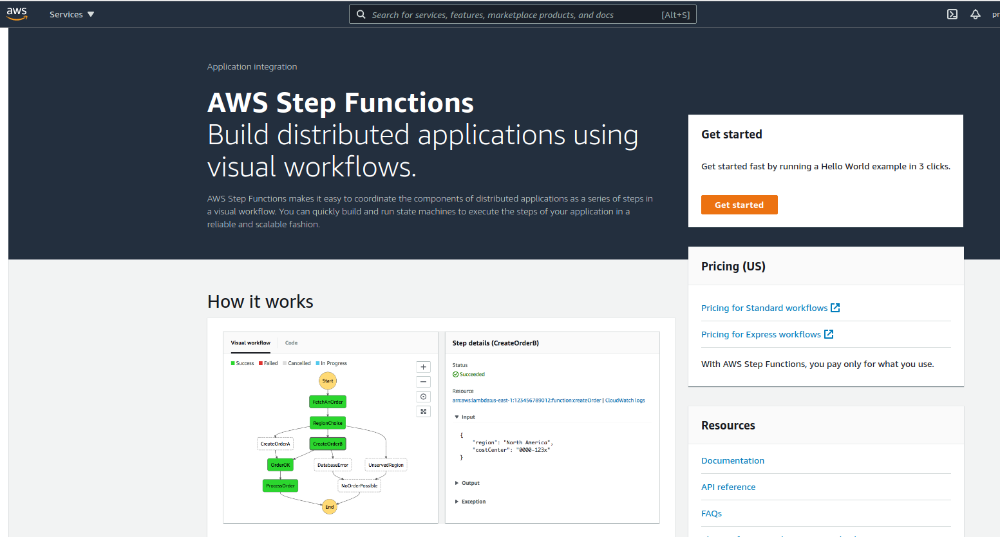
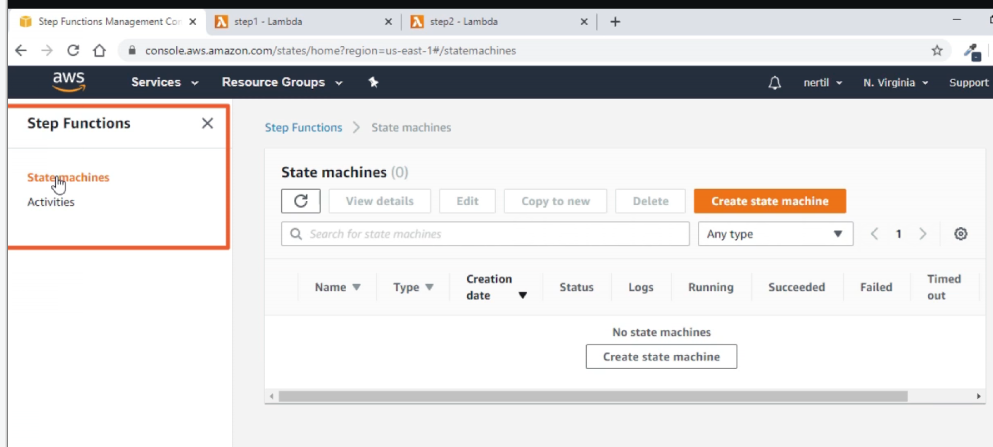
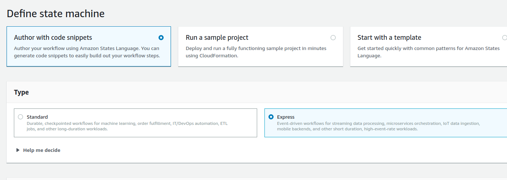
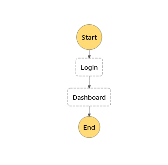
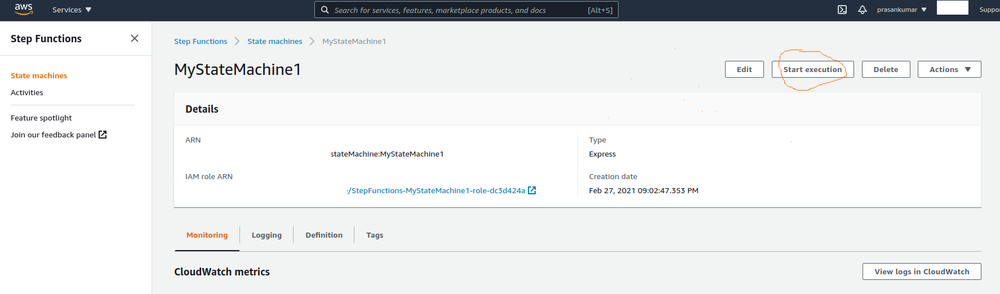
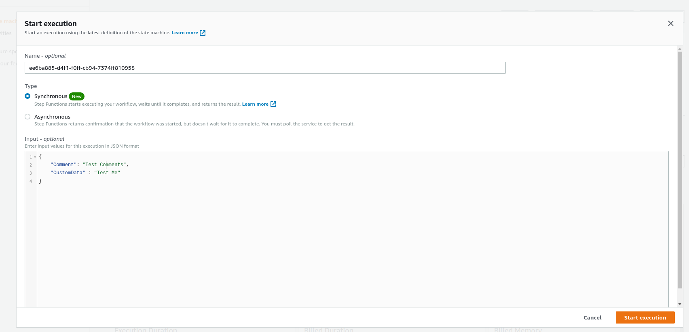
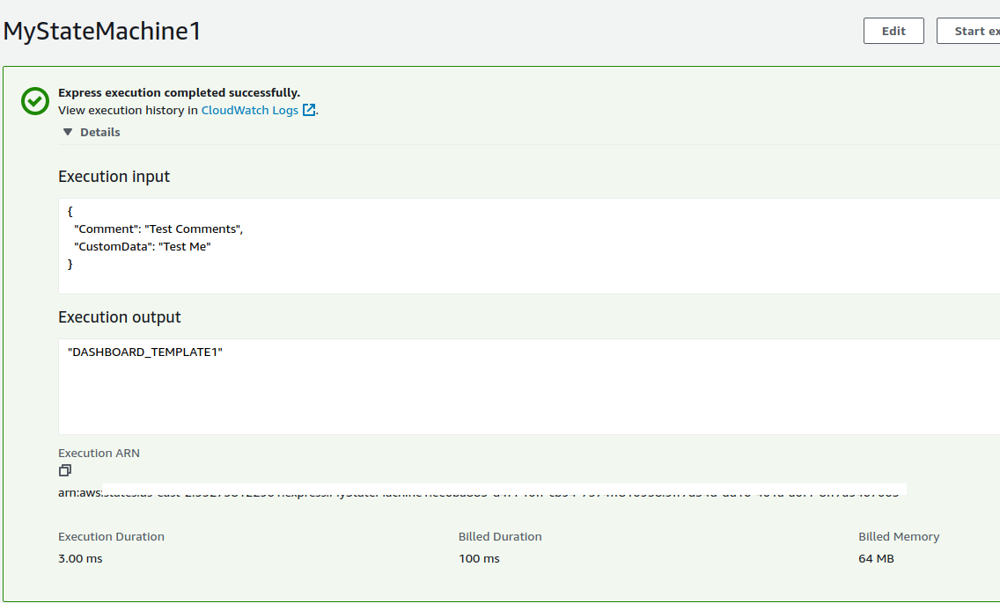
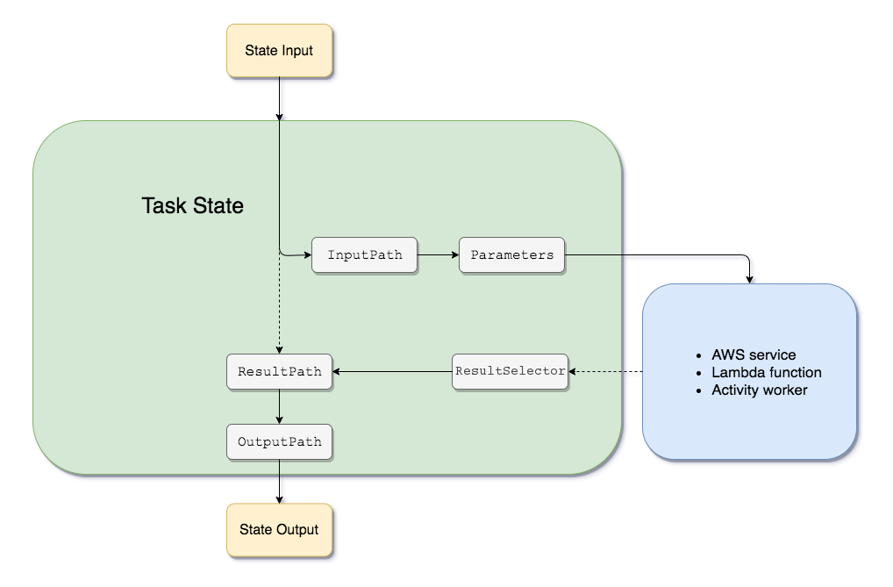

# Creating AWS Step Function Workflows

- Create AWS Step Functions Workflow
  - Execute two Lambda Functions in sequence

### Create/ signIn in AWS console account

- [AWS console URL](https://aws.amazon.com/console/)

### Basic sample (Express)

- Search for step functions in search box



- Select "State machine" from left side bar & click on "Create state machine" in the page
  

- Choose "Author with code snippets" for custom building, also choose "Express" type
  

- Add code definition

```js
{
  "Comment": "A simple example of the Amazon States Language using Pass states",
  "StartAt": "Login",
  "States": {
    "Login": {
      "Type": "Pass",
      "Result": "LOGIN_TEMPLATE1",
      "Next": "Dashboard"
    },
    "Dashboard": {
      "Type": "Pass",
      "Result": "DASHBOARD_TEMPLATE1",
      "End": true
    }
  }
}
```



- start execution
  

- Choose synchronous execution, so that flow is executed & final result is obtained
- Provide any sample input
  

- Final output
  - (In this example) individual task output is overridden by next task
    

### Other examples

<details>

<summary>
  add each task output in the final output (string)
</summary>

- code definition

```js
{
  "Comment": "A simple example of the Amazon States Language using Pass states",
  "StartAt": "Login",
  "States": {
    "Login": {
      "Type": "Pass",
      "Result": "LOGIN_TEMPLATE1",
      "ResultPath": "$.login", //$ is input object (here)
      "Next": "Dashboard"
    },
    "Dashboard": {
      "Type": "Pass",
      "Result": "DASHBOARD_TEMPLATE1",
      "ResultPath": "$.dashboard",
      "End": true
    }
  }
}
```

- Input

```js
{
    "Comment": "test comments",
    "customData" : "Test data"
}
```

- output

```js
{
  "Comment": "test comments",
  "customData": "Test data",
  "login": "LOGIN_TEMPLATE1",
  "dashboard": "DASHBOARD_TEMPLATE1"
}
```

</details>

  <br/>

<details>

<summary>
   add each task output in the final output (object)
</summary>

- code definition

```js
{
  "Comment": "A simple example of the Amazon States Language using Pass states",
  "StartAt": "TaskLogin",
  "States": {
    "TaskLogin": {
      "Type": "Pass",
      "ResultPath": "$.TaskStart",
      "Result": {
        "CstTemplate": "LOGIN_TEMPLATE",
        "CstOverrideTemplate": "LOGIN1",
        "CstNextTask":"TaskDashboard"
      },
      "Next": "TaskDashboard"
    },
    "TaskDashboard": {
      "Type": "Pass",
      "ResultPath": "$.TaskDashboard",
      "Result": {
        "CstTemplate": "DASHBOARD_TEMPLATE",
        "CstOverrideTemplate": "DASHBOARD1",
        "CstNextTask": "TaskPan"
      },
      "Next": "TaskPan"
    },
    "TaskPan": {
      "Type": "Pass",
      "ResultPath": "$.TaskPan",
      "Result": {
        "CstTemplate": "PAN_TEMPLATE",
        "CstOverrideTemplate": "PAN2",
        "CstNextTask": ""
      },
      "End": true
    }
  }
}
```

- input

```js
{
  "Comment": "Insert your JSON here"
}
```

- output

```js
{
  "Comment": "Insert your JSON here",
  "TaskStart": {
    "CstTemplate": "LOGIN_TEMPLATE",
    "CstOverrideTemplate": "LOGIN1",
    "CstNextTask": "TaskDashboard"
  },
  "TaskDashboard": {
    "CstTemplate": "DASHBOARD_TEMPLATE",
    "CstOverrideTemplate": "DASHBOARD1",
    "CstNextTask": "TaskPan"
  },
  "TaskPan": {
    "CstTemplate": "PAN_TEMPLATE",
    "CstOverrideTemplate": "PAN2",
    "CstNextTask": ""
  }
}
```

</details>

<br/>

<details>

<summary>
    Use parameters section to Access input values. Input values were not readable in result section directly. (.)
</summary>

- code definition

```js
{
  "Comment": "A simple example of the Amazon States Language using Pass states",
  "StartAt": "TaskLogin",
  "States": {
    "TaskLogin": {
      "Type": "Pass",
      "ResultPath": "$.TaskStart",
      "Parameters": {
        "greet":"hi",
        "myVariable.$":"$.var1" //say var1 is in input object
      },
         "End": true
    }
  }
}
```

- input

```js
{
  "var1": "dummy text",
  "var2": "dummy text 2"
}
```

- output

```js
{
  "var1": "dummy text",
  "var2": "dummy text 2",
  "TaskStart": {
    "greet": "hi",
    "myVariable": "dummy text"
  }
}
```

</details>

<br/>

## Links



- To get exact output use "outputPath" in state machine's last task

- [Input output path](https://docs.aws.amazon.com/step-functions/latest/dg/input-output-example.html)

- [Intrinsic function](https://docs.aws.amazon.com/step-functions/latest/dg/amazon-states-language-intrinsic-functions.html)
