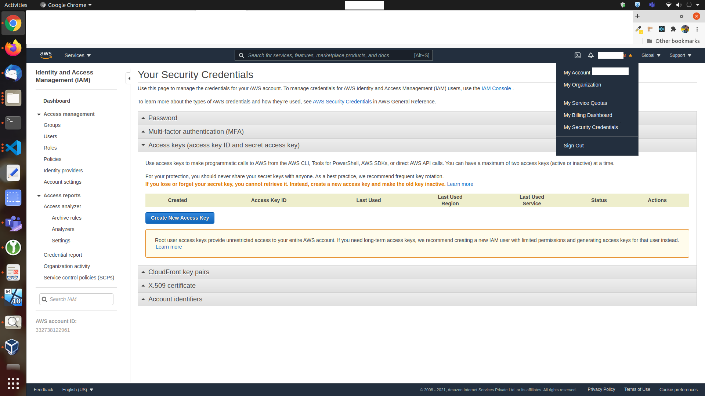
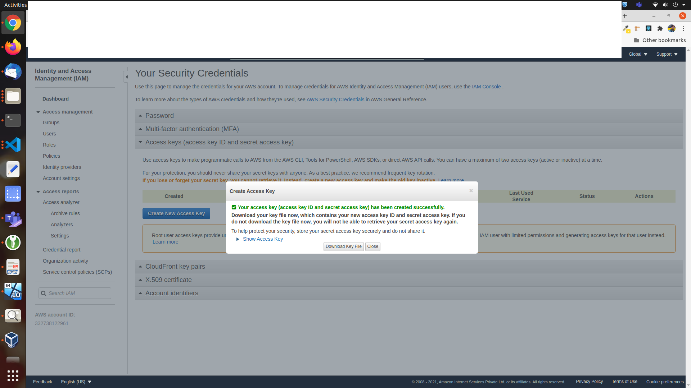

# AWS javascript SDK

## Link

- [AWS JS SDK API](https://docs.aws.amazon.com/AWSJavaScriptSDK/latest/AWS/StepFunctions.html#startExecution-property)

- [v3 dev guide modular package.json](https://docs.aws.amazon.com/sdk-for-javascript/v3/developer-guide/getting-started-nodejs.html)

- [sample article](https://dev.to/openstepmedia/using-aws-step-functions-with-nodejs-11i5)

## Install

```sh
npm install aws-sdk --save
```

## file.js

- code file

```js
var AWS = require("aws-sdk/global"); // import AWS object without services
var StepFunctions = require("aws-sdk/clients/stepfunctions"); // import individual service

const awsConfig = new AWS.Config({
  accessKeyId: Env.get("AWS_ACCESS_KEY"),
  secretAccessKey: Env.get("AWS_SECRET_KEY"),
  region: Env.get("AWS_REGION"),
  apiVersion: "2016-11-23", //locking API version
});

const stepFunctionsObj = new AWS.StepFunctions(awsConfig);
const AWS_STATE_MACHINE_ARN = "*****";

let inputObj = {
  myComments: "test comment",
};

let params = {
  stateMachineArn: AWS_STATE_MACHINE_ARN /* required */,
  input: JSON.stringify(inputObj),
  name: "my-workflow-1",
};

let promObj = stepFunctionsObj.startSyncExecution(params).promise();

promObj
  .then((data) => {
    console.log(data);
  })
  .catch((err) => {
    console.error(err);
  });
```

- Run file

```sh
node file.js
```

- Output

```js
{
    executionArn: '****',
    stateMachineArn: '****',
    name: 'my-workflow-1',
    startDate: "2021-02-27T21:02:37.162Z",
    stopDate: "2021-02-27T21:02:37.192Z",
    status: 'SUCCEEDED',
    input: '{"myComments":"test comment"}',
    inputDetails: {
        included: true
    },
    output: '{"myComments":"test comment","login":"LOGIN_TEMPLATE1","dashboard":"DASHBOARD_TEMPLATE1"}',
    outputDetails: {
        included: true
    },
    billingDetails: {
        billedMemoryUsedInMB: 64,
        billedDurationInMilliseconds: 100
    }
}
```

- Note : If startExecution is used instead startSyncExecution then only executionArn & startDate will be returned. Further details must be again queried !

## Others

### Get AWS_ACCESS_KEY & AWS_SECRET_KEY

- In AWS console Account, choose "My security credentials"



- Click on "Create new access key", Download the key details


