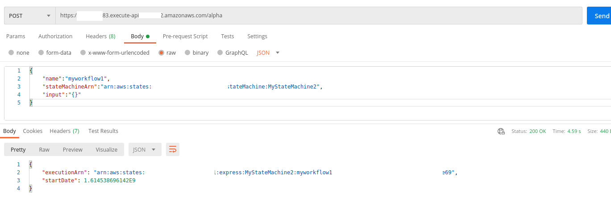

## API gate way

- Search "API gateway" service in search box

- Click on **Build** in REST API (complete control)

- Create API page
  

  

  

  

  

### TO fill execution role IAM

- open AWS console in new tab & search for "IAM" service in search box

- Click on Roles in left side bar & 'Create role' button on screen

- Select 'AWS Service' type, 'API gateway' use case & click on Next

- Click Next

- Click Next

- Fill role details & click 'Create role'
  
  

- Click on newly created role
  

- IN permission section, click on attach policy.
  search for step function, select 'AWSStepFunctionsFullAccess' & click on 'Attach Policy'
  

- Finally copy the role ARN
  

### API gateway continued

- Fill the role ARN & click on save
  

- CLick on test
  

  

  

  

### Deploy API to test remote

- In actions, choose deploy API
  
  

- Copy the invoke URL  
  

- Test URL in postman
  

## Links

- [API gateway step functions docs](https://docs.aws.amazon.com/step-functions/latest/dg/tutorial-api-gateway.html)
