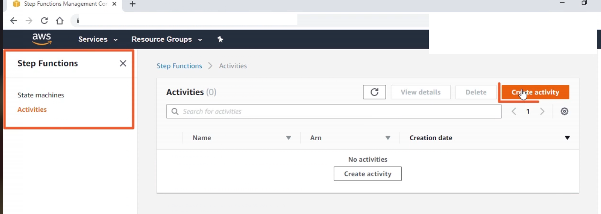
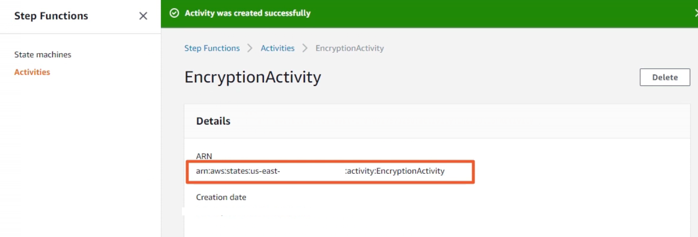
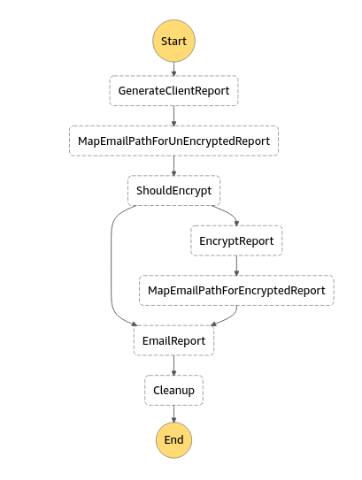
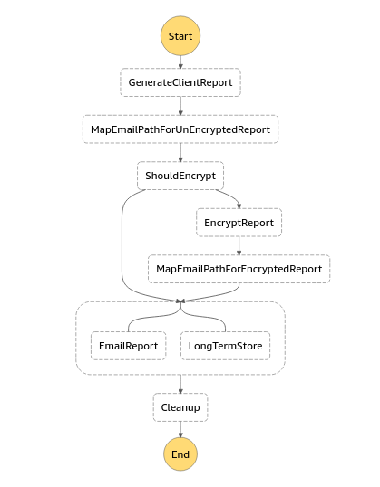

## Lambda function task

```js
{
    "EncryptReport": {
        "Type": "Task",
        "Resource": "arn:aws:states:::lambda:invoke",
        "Parameters": {
            "FunctionName": "arn:aws:lambda:us-east-X:XXXX:function:globomantics-encrypt",
            "Payload": {
                "reportFile.$": "$.reportOptions.reportData.unencryptedFile"
            }
        },
        "ResultPath": "$.encryptionOutput",
        "Next": "MapEmailPathForEncryptedReport"
    }
}
```

## Retry & Catch

```js
{
    "EmailReport": {
        "Type": "Task",
        "Resource": "arn:aws:states:::lambda:invoke",
        "Retry": [{
            "ErrorEquals": ["EmailSendingFailure"],
            "IntervalSeconds": 15,
            "MaxAttempts": 2,
            "BackoffRate": 4 // say first attempt in 15 seconds, next attempt is n * 4 * 15 (if n=1 , it's 60 seconds), next attempt is 2 * 4 * 15
        }],
        "Catch": [{
                "ErrorEquals": ["EmailSendingFailure"], //specific error catch
                "Next": "Cleanup",
                "ResultPath": "$.emailSendingError"
            },
            {
                "ErrorEquals": ["States.All"], //generic error catch
                "Next": "Cleanup",
                "ResultPath": "$.encryptionError"
            }
        ],
        "Parameters": {
            "FunctionName": "arn:aws:lambda:us-east-X:XXXX:function:globomantics-email",
            "Payload": {
                "emailFile.$": "$.reportOptions.reportData.emailFile",
                "clientEmail.$": "$.reportOptions.clientEmail",
                "emailSubject.$": "$.reportOptions.emailSubject",
                "emailBody.$": "$.reportOptions.emailBody"
            }
        },
        "ResultPath": "$.emailOutput",
        "Next": "Cleanup"
    }
}
```

- BackoffRate : The multiplier by which the retry interval increases during each attempt (2.0 by default).

## Choice

```js
{
    "ShouldEncrypt": {
        "Type": "Choice",
        "Choices": [{
                "Variable": "$.reportOptions.shouldEncrypt",
                "BooleanEquals": true,
                "Next": "EncryptReport"
            },
            {
                "Variable": "$.reportOptions.shouldEncrypt",
                "BooleanEquals": false,
                "Next": "EmailAndStore"
            }
        ],
        "Default": "EmailAndStore"
    }
}
```

## Parallel

```js
{
    "EmailAndStore": {
        "Type": "Parallel",
        "Next": "Cleanup",
        "ResultPath": "$.emailAndStoreOutput",
        "Branches": [{
                "StartAt": "EmailReport",
                "States": {
                    "EmailReport": {
                        "Type": "Task",
                        "Resource": "arn:aws:states:::lambda:invoke",
                        "Parameters": {
                            "FunctionName": "arn:aws:lambda:us-east-X:XXXX:function:globomantics-email",
                            "Payload": {
                                "emailFile.$": "$.reportOptions.reportData.emailFile",
                                "clientEmail.$": "$.reportOptions.clientEmail",
                                "emailSubject.$": "$.reportOptions.emailSubject",
                                "emailBody.$": "$.reportOptions.emailBody"
                            }
                        },
                        "ResultPath": "$.emailOutput",
                        "End": true
                    }
                }
            },
            {
                "StartAt": "LongTermStore",
                "States": {
                    "LongTermStore": {
                        "Type": "Task",
                        "Resource": "arn:aws:states:::lambda:invoke",
                        "Parameters": {
                            "FunctionName": "arn:aws:lambda:us-east-X:XXXX:function:Globomantics-longterm-report-store",
                            "Payload": {
                                "emailFile.$": "$.reportOptions.reportData.emailFile"
                            }
                        },
                        "ResultPath": "$.longTermStorageOutput",
                        "End": true
                    }
                }
            }
        ],
        "Retry": [{
            "ErrorEquals": [
                "EmailSendingFailure"
            ],
            "IntervalSeconds": 15,
            "MaxAttempts": 2,
            "BackoffRate": 4
        }],
        "Catch": [{
                "ErrorEquals": [
                    "EmailSendingFailure"
                ],
                "Next": "Cleanup",
                "ResultPath": "$.emailSendingError"
            },
            {
                "ErrorEquals": [
                    "States.All"
                ],
                "Next": "Cleanup",
                "ResultPath": "$.encryptionError"
            }
        ]
    }
}
```

## Activity

- Create activity (just name)



- Copy ARN & use in code definition json



- From code, using ARN - can listen if that Activity task has been reached & execution is pending. If pending then activity task can be executed

### Points

- Load & perform tasks
- Notify on success
- Notify on failure
- Send heart beat

```js
{
    "EncryptReport": {
        "Type": "Task",
        "Resource": "arn:aws:states:us-east-X:XXXX:activity:EncryptionActivity",
        "Parameters": {
            "reportFile.$": "$.reportOptions.reportData.unencryptedFile"
        },
        "ResultPath": "$.encryptionOutput",
        "Next": "MapEmailPathForEncryptedReport"
    }
}
```

<details>
<summary>
Sample code in files
</summary>

```js
var handler = require("./index");

handler.StartActivity();
```

```js
//index.js

const AWS = require("aws-sdk");
const AmazonS3URI = require("amazon-s3-uri");
const Secrets = require("./secrets").secrets;
const crypto = require("crypto");
const algorithm = "aes-256-ctr";
let key = "MySuperSecretKey";
key = crypto
  .createHash("sha256")
  .update(String(key))
  .digest("base64")
  .substr(0, 32);

var s3 = new AWS.S3({
  accessKeyId: Secrets.SecretId,
  secretAccessKey: Secrets.SecretKey,
});
exports.StartActivity = async () => {
  let stepfunction = new AWS.StepFunctions({
    region: "us-east-1",
    accessKeyId: Secrets.SecretId,
    secretAccessKey: Secrets.SecretKey,
  });

  let activityArn =
    "arn:aws:states:us-east-1:049827573258:activity:EncryptionActivity";

  //so infinitely listening for tasks (in this example)
  while (true) {
    try {
      let taksData = await getActivityTask(stepfunction, activityArn);
      console.log(taksData);
      var payload = JSON.parse(taksData.input);

      const { bucket, key } = AmazonS3URI(payload.reportFile);

      getReportFile(bucket, key).then((data) => {
        console.log("s3 data", data);
        var encrypted = encrypt(data);

        //send hearbeat //for long running task useful to convey it's presence (.)
        stepfunction.sendTaskHeartbeat({ taskToken: taksData.taskToken });

        uploadEncryptedFile(encrypted, bucket)
          .then((encryptedUri) => {
            stepfunction.sendTaskSuccess(
              {
                output: JSON.stringify({
                  Payload: encryptedUri,
                }),
                taskToken: taksData.taskToken,
              },
              (err, data) => {
                if (err) {
                  console.log("error", err);
                } else {
                  console.log("success", data);
                }
              }
            );
          })
          .catch((err) => {
            stepfunction.sendTaskFailure(
              {
                cause: JSON.stringify(err),
                taskToken: this.taskToken,
              },
              (err, data) => {
                if (err) {
                  console.log("error", err);
                } else {
                  console.log("success", data);
                }
              }
            );
          });
      });
    } catch (err) {}
    await sleep(2000);
  }
};
function sleep(ms) {
  return new Promise((resolve) => setTimeout(resolve, ms));
}
async function getActivityTask(stepfunction, activityArn) {
  return new Promise((resolve, reject) => {
    console.log("Getting Activity Task");
    stepfunction.getActivityTask(
      {
        activityArn: activityArn,
      },
      (err, data) => {
        if (err) {
          console.log("Error Getting Task Data", err);
          if (err.code === "RequestAbortedError") {
            // In case of abort, close silently
          } else {
            reject(err);
          }

          return;
        }
        console.log("Task Data", data);
        if (
          data.taskToken &&
          typeof data.taskToken === "string" &&
          data.taskToken.length > 1
        ) {
          resolve(data);
        } else {
          resolve(null);
        }
      }
    );
  });
}

function encrypt(buffer) {
  // Create an initialization vector
  const iv = crypto.randomBytes(16);
  // Create a new cipher using the algorithm, key, and iv
  const cipher = crypto.createCipheriv(algorithm, key, iv);
  // Create the new (encrypted) buffer
  const result = Buffer.concat([iv, cipher.update(buffer), cipher.final()]);
  return result;
}

async function getReportFile(bucket, key) {
  return new Promise((resolve, reject) => {
    try {
      const params = {
        Bucket: bucket,
        Key: key,
      };
      s3.getObject(params, (err, data) => {
        resolve(data.Body);
      });
    } catch (err) {
      reject(err);
    }
  });
}

function uploadEncryptedFile(input, bucket) {
  return new Promise((resolve, reject) => {
    const fileUploadParams = {
      Bucket: bucket,
      Key: randomId(15) + "-encrypted.pdf",
      Body: new Buffer(input),
    };
    s3.upload(fileUploadParams, function (err, data) {
      if (err) {
        reject(err);
      } else {
        resolve(data.Location);
      }
    });
  });
}

function randomId(length) {
  var result = "";
  var characters =
    "ABCDEFGHIJKLMNOPQRSTUVWXYZabcdefghijklmnopqrstuvwxyz0123456789";
  var charactersLength = characters.length;
  for (var i = 0; i < length; i++) {
    result += characters.charAt(Math.floor(Math.random() * charactersLength));
  }
  return result;
}
```

</details>

## Links

- [AWS docs error handling](https://docs.aws.amazon.com/step-functions/latest/dg/concepts-error-handling.html)

## Online examples

<details>
<summary>
Report generation
</summary>

- Visualization



- code definition

```js
{
    "StartAt": "GenerateClientReport",
    "States": {
      "GenerateClientReport": {
        "Type": "Task",
        "Resource": "arn:aws:states:::lambda:invoke",
        "Parameters": {
          "FunctionName": "arn:aws:lambda:us-east-X:XXXX:function:globomantics-report-create",
          "Payload": {}
        },
        "ResultPath": "$.reportGenerationOutput",
        "Next": "MapEmailPathForUnEncryptedReport"
      },
      "MapEmailPathForUnEncryptedReport": {
        "Type": "Pass",
        "Parameters": {
          "emailFile.$": "$.reportGenerationOutput.Payload",
          "unencryptedFile.$": "$.reportGenerationOutput.Payload",
          "encryptedFile": ""
        },
        "ResultPath": "$.reportOptions.reportData",
        "Next": "ShouldEncrypt"
      },
      "ShouldEncrypt": {
        "Type": "Choice",
        "Choices": [
          {
            "Variable": "$.reportOptions.shouldEncrypt",
            "BooleanEquals": true,
            "Next": "EncryptReport"
          },
          {
            "Variable": "$.reportOptions.shouldEncrypt",
            "BooleanEquals": false,
            "Next": "EmailReport"
          }
        ],
        "Default": "EmailReport"
      },
      "EncryptReport": {
        "Type": "Task",
        "Resource": "arn:aws:states:::lambda:invoke",
        "Parameters": {
          "FunctionName": "arn:aws:lambda:us-east-X:XXXX:function:globomantics-encrypt",
          "Payload": {
            "reportFile.$": "$.reportOptions.reportData.unencryptedFile"
          }
        },
        "ResultPath": "$.encryptionOutput",
        "Next": "MapEmailPathForEncryptedReport"
      },
      "MapEmailPathForEncryptedReport": {
        "Type": "Pass",
        "Parameters": {
          "emailFile.$": "$.encryptionOutput.Payload",
          "encryptedFile.$": "$.encryptionOutput.Payload",
          "unencryptedFile.$": "$.reportGenerationOutput.Payload"
        },
        "ResultPath": "$.reportOptions.reportData",
        "Next": "EmailReport"
      },
      "EmailReport": {
        "Type": "Task",
        "Resource": "arn:aws:states:::lambda:invoke",
          "Retry": [
          {
            "ErrorEquals": ["EmailSendingFailure"],
            "IntervalSeconds": 15,
            "MaxAttempts": 2,
            "BackoffRate": 4
          }
        ],
         "Catch": [
          {
            "ErrorEquals": ["EmailSendingFailure" ],
            "Next": "Cleanup",
            "ResultPath": "$.emailSendingError"
          },
           {
            "ErrorEquals": [ "States.All"],
            "Next": "Cleanup",
            "ResultPath": "$.encryptionError"
          }
        ],
        "Parameters": {
          "FunctionName": "arn:aws:lambda:us-east-X:XXXX:function:globomantics-email",
          "Payload": {
            "emailFile.$": "$.reportOptions.reportData.emailFile",
            "clientEmail.$": "$.reportOptions.clientEmail",
            "emailSubject.$": "$.reportOptions.emailSubject",
            "emailBody.$": "$.reportOptions.emailBody"
          }
        },
        "ResultPath": "$.emailOutput",
        "Next": "Cleanup"
      },
      "Cleanup": {
        "Type": "Task",
        "Resource": "arn:aws:states:::lambda:invoke",
        "Parameters": {
          "FunctionName": "arn:aws:lambda:us-east-X:XXXX:function:globomantics-cleanup",
          "Payload": {
            "files": {

              "unencryptedFile.$": "$.reportOptions.reportData.unencryptedFile"
            }
          }
        },
        "ResultPath": "$.cleanupOutput",
        "End": true
      }
    }
  }
```

</details>

<br/>

<details>
<summary>
Activity parallel workflow
</summary>

- Visualization
  

- code definition

```js
{
    "StartAt": "GenerateClientReport",
    "States": {
      "GenerateClientReport": {
        "Type": "Task",
        "Resource": "arn:aws:states:::lambda:invoke",
        "Parameters": {
          "FunctionName": "arn:aws:lambda:us-east-X:XXXX:function:globomantics-report-create",
          "Payload": {}
        },
        "ResultPath": "$.reportGenerationOutput",
        "Next": "MapEmailPathForUnEncryptedReport"
      },
      "MapEmailPathForUnEncryptedReport": {
        "Type": "Pass",
        "Parameters": {
          "emailFile.$": "$.reportGenerationOutput.Payload",
          "unencryptedFile.$": "$.reportGenerationOutput.Payload",
          "encryptedFile": ""
        },
        "ResultPath": "$.reportOptions.reportData",
        "Next": "ShouldEncrypt"
      },
      "ShouldEncrypt": {
        "Type": "Choice",
        "Choices": [
          {
            "Variable": "$.reportOptions.shouldEncrypt",
            "BooleanEquals": true,
            "Next": "EncryptReport"
          },
          {
            "Variable": "$.reportOptions.shouldEncrypt",
            "BooleanEquals": false,
            "Next": "EmailAndStore"
          }
        ],
        "Default": "EmailAndStore"
      },
      "EncryptReport": {
        "Type": "Task",
        "Resource": "arn:aws:states:us-east-X:XXXX:activity:EncryptionActivity",
        "Parameters": {
          "reportFile.$": "$.reportOptions.reportData.unencryptedFile"
        },
        "ResultPath": "$.encryptionOutput",
        "Next": "MapEmailPathForEncryptedReport"
      },
      "MapEmailPathForEncryptedReport": {
        "Type": "Pass",
        "Parameters": {
          "emailFile.$": "$.encryptionOutput",
          "encryptedFile.$": "$.encryptionOutput",
          "unencryptedFile.$": "$.reportGenerationOutput.Payload"
        },
        "ResultPath": "$.reportOptions.reportData",
        "Next": "EmailAndStore"
      },
      "EmailAndStore": {
        "Type": "Parallel",
        "Next": "Cleanup",
        "ResultPath": "$.emailAndStoreOutput",
        "Branches": [
          {
            "StartAt": "EmailReport",
            "States": {
              "EmailReport": {
                "Type": "Task",
                "Resource": "arn:aws:states:::lambda:invoke",
                "Parameters": {
                  "FunctionName": "arn:aws:lambda:us-east-X:XXXX:function:globomantics-email",
                  "Payload": {
                    "emailFile.$": "$.reportOptions.reportData.emailFile",
                    "clientEmail.$": "$.reportOptions.clientEmail",
                    "emailSubject.$": "$.reportOptions.emailSubject",
                    "emailBody.$": "$.reportOptions.emailBody"
                  }
                },
                "ResultPath": "$.emailOutput",
                "End": true
              }
            }
          },
          {
            "StartAt": "LongTermStore",
            "States": {
              "LongTermStore": {
                "Type": "Task",
                "Resource": "arn:aws:states:::lambda:invoke",
                "Parameters": {
                  "FunctionName": "arn:aws:lambda:us-east-X:XXXX:function:Globomantics-longterm-report-store",
                  "Payload": {
                    "emailFile.$": "$.reportOptions.reportData.emailFile"
                  }
                },
                "ResultPath": "$.longTermStorageOutput",
                "End": true
              }
            }
          }
        ],
        "Retry": [
          {
            "ErrorEquals": [
              "EmailSendingFailure"
            ],
            "IntervalSeconds": 15,
            "MaxAttempts": 2,
            "BackoffRate": 4
          }
        ],
        "Catch": [
          {
            "ErrorEquals": [
              "EmailSendingFailure"
            ],
            "Next": "Cleanup",
            "ResultPath": "$.emailSendingError"
          },
          {
            "ErrorEquals": [
              "States.All"
            ],
            "Next": "Cleanup",
            "ResultPath": "$.encryptionError"
          }
        ]
      },
      "Cleanup": {
        "Type": "Task",
        "Resource": "arn:aws:states:::lambda:invoke",
        "Parameters": {
          "FunctionName": "arn:aws:lambda:us-east-X:XXXX:function:globomantics-cleanup",
          "Payload": {
            "files": {
              "unencryptedFile.$": "$.reportOptions.reportData.unencryptedFile",
              "encryptedFile.$": "$.reportOptions.reportData.encryptedFile"
            }
          }
        },
        "ResultPath": "$.cleanupOutput",
        "End": true
      }
    }
  }
```

</details>
